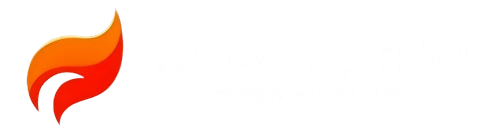

<p align="center">
<a href="https://vorel.app">

</a>
</p>


A Public web service that displays match schedules and results for FRC teams at events using the FIRST Nexus API and The Blue Alliance API.

<p align="center">
  <a href="https://github.com/1334Robotics/vorel-app/actions"
    ></a>
  <a href="https://vorel.app"
    ></img
  ></a>
  <a href="https://github.com/1334Robotics/vorel-app/commits/main/"
    ></a
  ><br />
  <a href="https://github.com/1334Robotics/vorel-app/blob/main/LICENSE"
    ></a
  >
  <a href="https://frc-events.firstinspires.org/team/1334"
    >
  </a>
</p>

## Features

- View all matches for a specific team at an event
- Real-time match status updates
- Display match results and scoring details
- Calculate and display ranking points earned
- Responsive design suitable for mobile and desktop
- Embeddable widget for use in other websites

<br /><br /><br /><br /><br /><br /><br /><br />

# Self-Hosting Installation


>[!NOTE]
> YOU DO NOT HAVE TO DO THIS!
> You can visit https://vorel.app and our service is there and ready to go for **FREE** with **NO ADS**


### Prerequisites

- Node.js (v16 or newer)
- NPM or Yarn

### Local Setup

1. Clone the repository
```bash
git clone https://github.com/1334Robotics/vorel-app.git
cd vorel-app
```

2. Install dependencies
```bash
npm install
```

3. Create a .env file based on the example
```bash
cp .env.example .env
```

4. Edit the .env file and add your API keys:
   - Get a Nexus API key from [FIRST Nexus](https://frc.nexus)
   - Get a TBA API key from [The Blue Alliance](https://www.thebluealliance.com/account)

## Usage

### Running locally

```bash
npm start
```

The server will start on port 3002 (or the port specified in your .env file).

Access the application by navigating to `http://localhost:3002` in your browser.

### How to use

1. Enter a team number (e.g., 1334 or frc1334)
2. Enter an event key (e.g., 2025oncmp2)
3. View match schedule and results

## Embedding in another website

You can embed the matches display in another website using an iframe:

```html
<iframe 
  src="http://your-server-url/embed?teamKey=1334&eventKey=2025oncmp2&height=600" 
  width="100%" 
  height="600" 
  frameborder="0">
</iframe>
```

## Docker Deployment

### Using docker-compose (recommended)

1. Create a .env file with your API keys as described above
2. Run the service using docker-compose:

```bash
docker-compose up -d
```

### Using Docker directly

```bash
docker build -t vorel-app .
docker run -p 3002:3002 --env-file .env vorel-app
```

## API Documentation

### Endpoints

- `GET /` - Main application page
- `GET /embed` - Embeddable version of match display
- `GET /api/health` - Health check endpoint
- `GET /api/data-check` - Checks if there are new updates to matches data

### Query Parameters

- `teamKey` - Team number (with or without "frc" prefix)
- `eventKey` - Event key (e.g., 2025oncmp2)
- `height` - (Embed only) Height of the container in pixels

## License

This project is licensed under the GNU General Public License v3.0 - see the LICENSE file for details.

## Acknowledgments

- [The Blue Alliance](https://www.thebluealliance.com) for match results data
- [FIRST Nexus](https://frc.nexus) for real-time match status updates